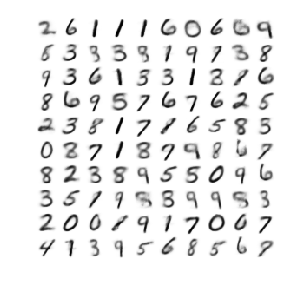

# Variational autoencoders in MXNet/Gluon

Various implementations of variational autoencoders using MXNet/Gluon.

## Basic implementation

### References:

1. Kingma, Diederik P., and Max Welling.
["Auto-encoding variational bayes."](https://arxiv.org/abs/1312.6114)
arXiv preprint arXiv:1312.6114 (2013).
2. Rezende, Danilo Jimenez, Shakir Mohamed, and Daan Wierstra.
["Stochastic backpropagation and approximate inference in deep generative models."](https://arxiv.org/abs/1401.4082)
 arXiv preprint arXiv:1401.4082 (2014).

### Code:

- Implementation using MXNet API (i.e. mxnet.sym, mxnet.mod) [vae-mxnet.ipynb](basic/vae-mxnet.ipynb)
- Implementation using Gluon API (i.e. gluon.HybridBlock, autograd) [vae-gluon.ipynb](basic/vae-gluon.ipynb)

### Results:

- Generated MNIST figures by randomly sampling learned latent space

With 2-D latent space | With 10-D latent space | With 20-D latent space
--- | --- | ---
 |  |

- Learned 2-D manifold

Latent feature Z corresponding to 1000 test images | Generated images from grid scan in Z | 
--- | ---
 | 

